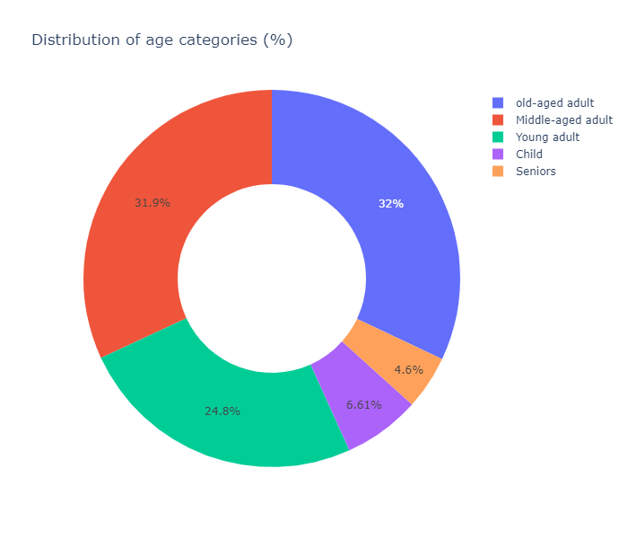
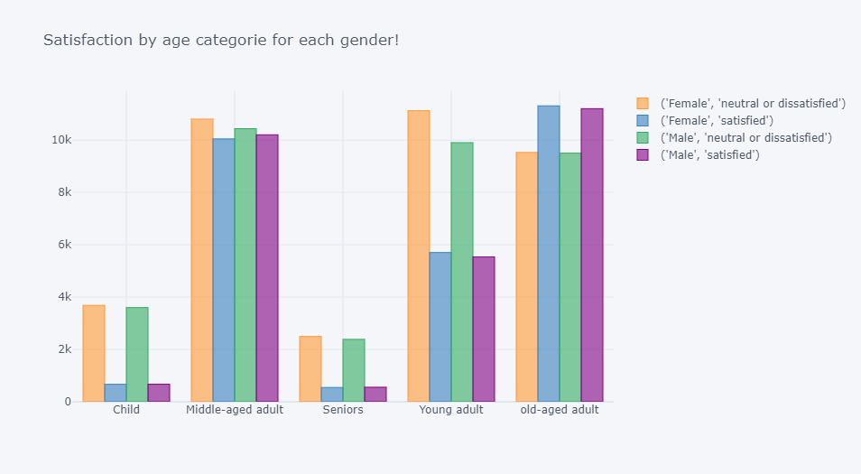
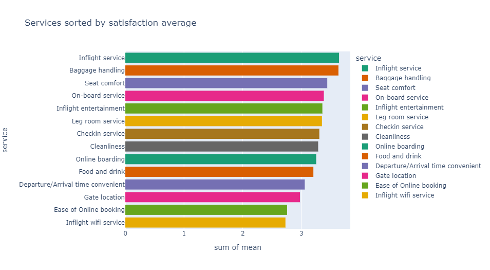
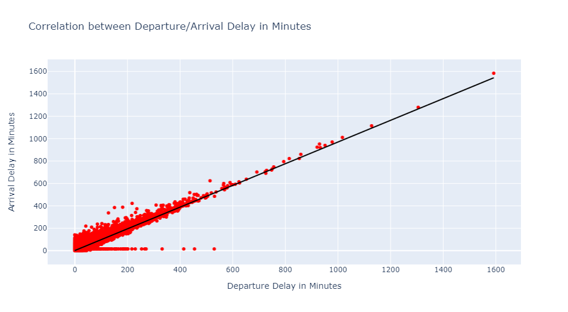
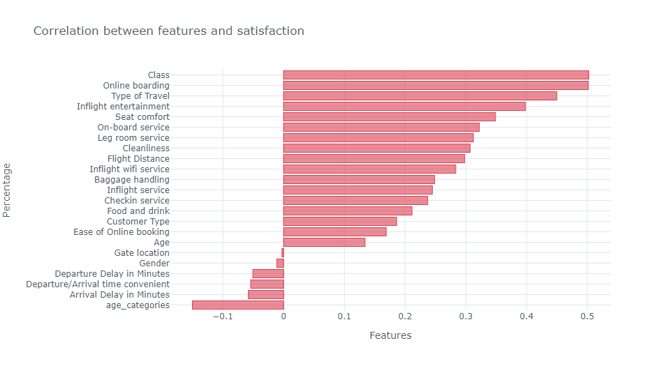

# Airline passengers satisfaction predictions based on a public dataset available on 'kaggle.com'.
## Project overview
* Based on the 'Airline Passenger Satisfaction' data available on kaggle.com I built a model to predict whether a pessanger would be satisfied or not based on some parameters (e.g. Seat comfort, Check-in service, Cleanliness, Departure/Arrival Delay in Minutes).
* Applied 2 different classifications models (Random Forest and XGBoost) to the data to find the best model.
* Built a client facing API using Flask

## Programming Language & Packages
* Python
* Packages: numpy, pandas, seanborn, sklearn, XGboost, itertools, pickle, flask, json

## Resources
* Flask Productionization: 
  * https://towardsdatascience.com/publishing-machine-learning-api-with-python-flask-98be46fb2440
  * https://pynative.com/python-serialize-numpy-ndarray-into-json/

## Data Cleaning
The dataset was in a good shape, just a few data cleaning and preprocessing was made:
* Droped 'Unnamed: 0', 'id' columns (not needed for Exploratory Data Analysis nor for ML models)
* Filled the missing values in the 'Arrival Delay in Minutes' column in a way that makes sense to me.

## Exploratory Data Analysis (EDA)
Checked the distributions and built many crosstab tables to answer some questions related to the pessangers satisfaction (e.g., satisfaction based on gender, satisfaction based on services, satisfaction based on customer type)
I also plot a graph to show correlation between features and the target (satisfaction). 
I also have a graph to show the correlation between Departure Delay in Minutes and Arrival Delay in Minutes.

     

## Models Building
I started by deleting outliers (rows containing extrem values), then converting the categorical features into numerical. The categories where the order matters I mapped its values. Categories where the order doens't matter I just got pandas dummies for it. After that I divding the dataset into train and test sets with train size of 80% and test size of 20%.
I build 2 different models (both of them are tree based) and evaluated them using the accuracy score(%) and confusion matrix. 
The models are: 
* Random Forest 
* XGBoost 

## Models Performance
* Random Forest - model accuracy = 96.3%
* XGBoost - model accuracy = 96.39%

From the models accuracy results we can see that the differece is too small (almost no difference), but the XGBoost model still has better performance than the Random Forest model.

## Productionization
I built a flask API endpoint that was hosted on a local server by following along with the 'towords data science' tutorial in the reference section below. The API endpoint takes in a request with a list of values from a pessanger feedback listing and returns a prediction of whether a pessanger would be satisfied or not.

## Data
* Data: https://www.kaggle.com/teejmahal20/airline-passenger-satisfaction

## Referances
* FlaskAPI : https://towardsdatascience.com/productionize-a-machine-learning-model-with-flask-and-heroku-8201260503d2

